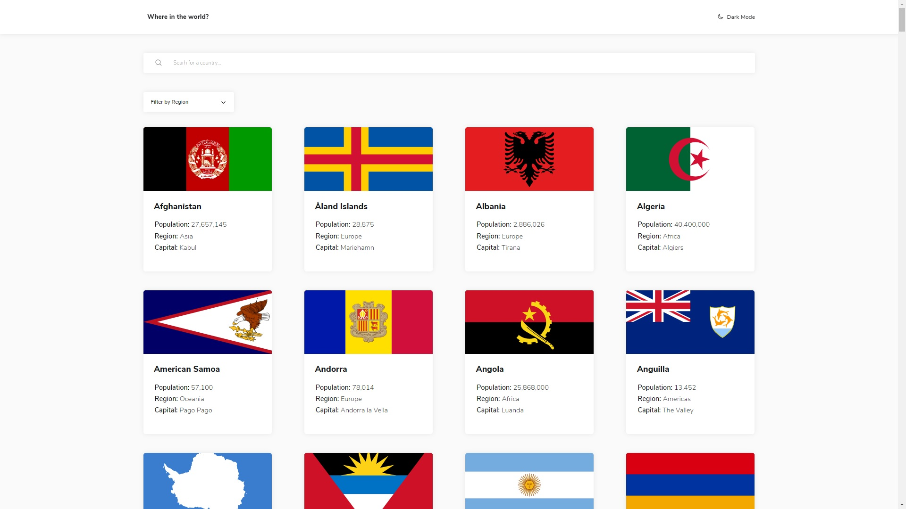

### The challenge

Users should be able to:

- See all countries from the API on the homepage
- Search for a country using an `input` field
- Filter countries by region
- Click on a country to see more detailed information on a separate page
- Click through to the border countries on the detail page
- Toggle the color scheme between light and dark mode 


### Screenshot




### Links

- Live Site URL: [Add live site URL here](https://vmpetkov90.github.io/REST-country-API-integration/)


### Built with

- HTML
- CSS
- Flexbox
- Bootstrap
- Mobile-first workflow
- JavaScript
- jQuery
- AJAX


### What I learned

Developing this project has helped me learn how to make request using AJAX and pull data from API in JSON and dislaying it.

```js
function getData(url, target) {
        $.getJSON(url)
            .done(function (result) {
                $(".country, .country-details, main p").remove();
                if (target === "back") {
                    changeNav();
                }
                for (let country of result) {
                    if (countries.length < result.length) {
                        countries.push({
                            fullName: country.name,
                            shortName: country.alpha3Code
                        });
                    }
                    const countryContainer = $(`<div class="country" data-code="${country.alpha3Code}"></div>`);
                    const flagContainer = $("<div class='flag-container'></div>");
                    const flag = $(``);
                    const infoContainer = $("<div class='info-container'></div>");
                    const name = $(`<h2>${country.name}</h2>`);
                    const population = $(`<p>Population: <span>${country.population.toLocaleString()}</span></p>`);
                    const region = $(`<p>Region: <span>${country.region}</span></p>`);
                    const capital = $(`<p>Capital: <span>${country.capital}</span></p>`);

                    flagContainer.append(flag);
                    infoContainer.append(name, population, region, capital);
                    countryContainer.append(flagContainer, infoContainer);
                    $("main .container").append(countryContainer);
                    $(".loader").removeClass("loading");
                }
            })
            .fail(function () {
                $(".country, .country-details, main p").remove();
                $("main .container").append("<p>Oops! Something went wrong!<p>");
                $(".loader").removeClass("loading");
            })
    }
```


## Author

- Website - [Vasil Petkov](https://www.vasilpetkov.com)